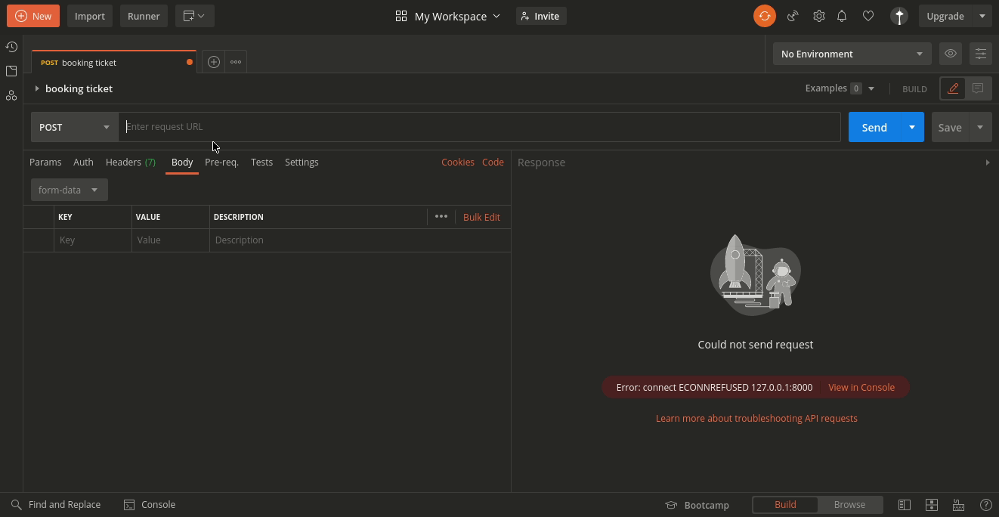
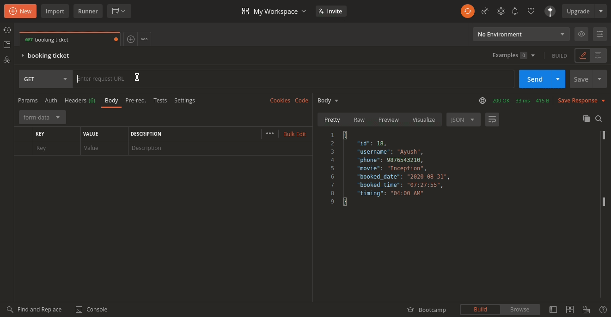
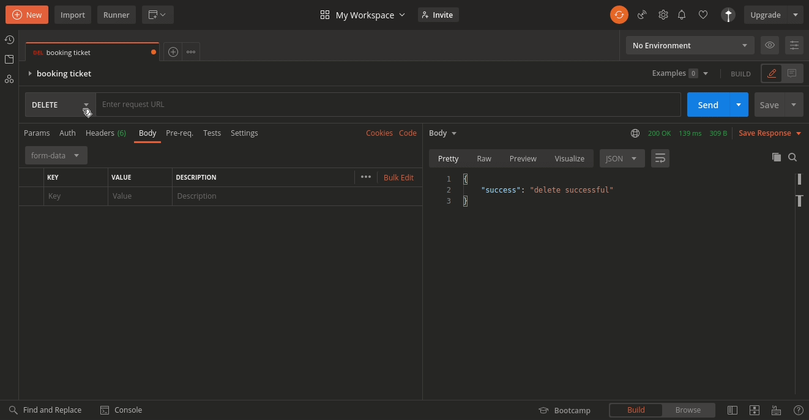
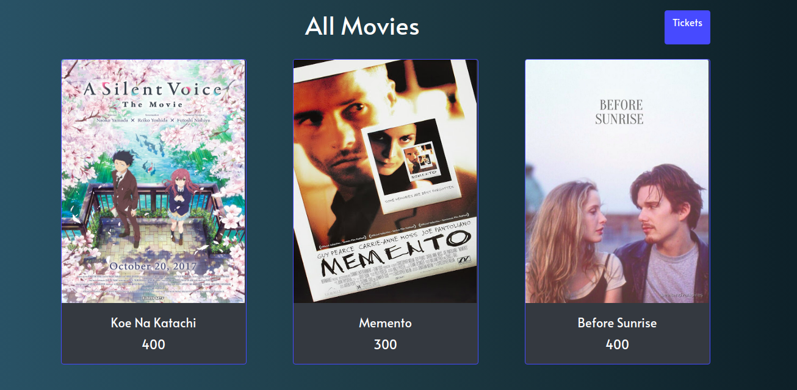

# Flickz

## Introduction
This is a REST interface for a movie theatre ticket booking system called **Flickz**.
**All the features expected in the hiring assessment document are fully functional. Testing Functionality has also been included.** Moreover, I have added some **optional** front-end to display an application of this REST Interface.

## Contents
- [Overview](https://github.com/DiAnant/Flickz#overview)
- [Installation](https://github.com/DiAnant/Flickz#installation)
- [Usage](https://github.com/DiAnant/Flickz/#usage)
	- [Endpoint 1: To Create a ticket](https://github.com/DiAnant/Flickz/#endpoint-1-to-create-a-ticket)
	- [Endpoint 2: To Update a ticket timing](https://github.com/DiAnant/Flickz/#endpoint-2-to-update-a-ticket-timing)
	- [Endpoint 3: To View all tickets for a particular time](https://github.com/DiAnant/Flickz/#endpoint-3-to-view-all-tickets-for-a-particular-time)
	- [Endpoint 4: To Delete a particular ticket](https://github.com/DiAnant/Flickz/#endpoint-4-to-delete-a-particular-ticket)
	- [Endpoint 5: To View the user's details based on ticket ID](https://github.com/DiAnant/Flickz/#endpoint-5-to-view-the-users-details-based-on-ticket-id)
- [Testing](https://github.com/DiAnant/Flickz/#testing)
- [Features](https://github.com/DiAnant/Flickz/#features)

## Overview
* Currently in this application, we have 6 different movies. All of these 6 movies have 4 different shows throughout the day. All the 6 movies and 4 different time-slots have their unique id from 1-6 and 1-4 respectively.
* Some tickets have already been booked and are added in the database. **Do note that the tickets will be deleted after 8 hours of booking as they'll get expired as per the requirement mentioned in the document.**
* **NOTE :** When entering details in Postman, we will refer to these movies and shows by their respective Id's and not the actual movie name and show time.
* The database can be accessed by going in to the `Flickz` directory and executing `sqlite3 db.sqlite3` and then type `.tables` to view all the tables and `.schema` of the database.

## Installation
* Install Python 3.8 from [here](https://www.python.org/downloads/release/python-382/)
* Install git from [here](https://git-scm.com/downloads)
* Install Postman from [here](https://www.postman.com/downloads/)
* Run `git clone https://github.com/DiAnant/Flickz.git`
* Run `pip install -r requirements.txt`

## Usage
* **NOTE :** You will require [Postman](https://www.postman.com/downloads/) to test the backend of the application.
* **All of these steps are depicted in seperate GIFs**
* Open a terminal window and go in the Flickz Directory. 
* Execute `python manage.py runserver` to run the Django server.
* Open Postman.

### Endpoint 1: To Create a ticket
* In the address bar of the Postman, insert `http://127.0.0.1:8000/api/ticket/create`, choose "POST" request in the dropdown and go to the body tab and select the `form-data` radio button. 
* Insert `username`, `phone`,`movie` and `timing` in the `KEY` field and their repective values in the `VALUE` field. Click `send` to create a ticket.

### Endpoint 2: To Update a ticket timing
* **Inorder to update the ticket timing you need to have the `id` of the ticket.**
* Insert `http://127.0.0.1:8000/api/ticket/{id}/update`, where id stands for `id` of the ticket. Change some values from the last form and choose `PUT` request from the dropdown and click send to update values of the ticket.

### Endpoint 3: To View all tickets for a particular time
* Insert `http://127.0.0.1:8000/api/ticket/time/{id}/` where `id == 1` is the showtime for 04:00 AM, `id == 2` is the showtime for 08:00 AM, `id == 3` is the showtime for 04:00 PM and `id == 4` is the showtime for 08:00 PM. Choose `GET` request from the dropdown and click send button.

### Endpoint 4: To Delete a particular ticket
* Insert `http://127.0.0.1:8000/api/ticket/{id}/delete` where `id` is the ticket id of the ticket to be deleted. Choose `DELETE` request from the dropdown and click send button.

### Endpoint 5: To View the user's details based on ticket ID
* Insert `http://127.0.0.1:8000/api/ticket/{id}/` where `id` is the ticket id. Choose `GET` request from the dropdown and click send button.

## Testing
* In the `Flickz/api/tests.py` file, you can find already prepared tests for all the endpoints and you can **test all the functionalities of the application just by executing the command `python manage.py test`**

## Features
* A ticket is marked expired and deleted from the database if there is a difference of 8 hours between the booked time and the current time.
* For a particular showtime, maximum of 20 seats can be booked.
* The Application is built by following the REST paradigm.
* Django REST Framework's internal functionality allows to use the browser for fetching and sending API requests like Postman.
* Added Optional frontend for viewing all movies and all tickets. All movies can be viewed at `http://127.0.0.1:8000` and all tickets can be viewed at `http://127.0.0.1:8000/tickets`

